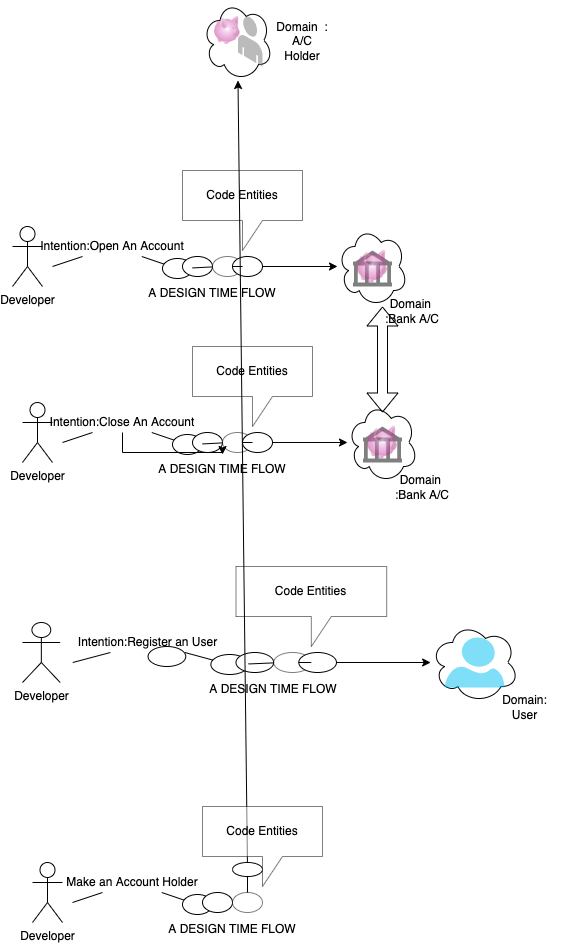

## What are the First Principles of Computing ?

One may think of 'following a logical thinking','ability to break bigger problems into smaller ones' , 'ability to see the commonality between different approaches ' etc as the first principles. However while each of those qualities are good imperatives, they hide a much more fundamental attitude of the mind. 
In a one word this is "Intentions" , described in wikipedia as below:

"Intentions are mental states in which the agent commits themselves to a course of action. Having the plan to visit the zoo tomorrow is an example of an intention. The action plan is the content of the intention while the commitment is the attitude towards this content. Other mental states can have action plans as their content, as when one admires a plan, but differ from intentions since they do not involve a practical commitment to realizing this plan. Successful intentions bring about the intended course of action while unsuccessful intentions fail to do so. Intentions, like many other mental states, have intentionality: they represent possible states of affairs."

If we follow the developer's first steps, in coding a piece of software ,it can be proposed with enough confidence that the intention the coder had, definitely plays a part in the shape and content of code as it is developed. This foundational role of intention,however covers,not only coding but also everything that the human kind design and contribute to the real world. Inspite of this obvious truth there remains no standard way to represent 'Intention' in software such that it can help the current and future developers who want to continue developing the code over time.

## CONTEXTFLOW

Contextflow is a methodology and a protocol to develop software ,in small pieces ,that can be joined up and composed through explicit intentions. 
Intentions serve as design time flow of design choices and connections. Contextflow recognises certain phrases used inside the software code or used even during the software lifecycle ,during the communication between developers and stakeholders, has a unique identification that can work as a hook into the intentions and design thoughts that are brought to life during development. As a software is weaved out from smaller pieces ,some of those critical phrases repeat in several situations and code conditions or contexts. Retention of these critical phrases in the right context during the development process gives some surprising benifit in having some unique virtual adress of each resource used by the software like port numbers, files ,memory addresses and outputs. These virtual addresses of resources can also work favourably in allocating resources dynamically as the software is executed. 

## CONTEXTFLOW & INTENTIONS

It is rather un-usual to bring the intentions into daily software life-dynamics. However once we start to look at intention as an outlook a developer has- when the developer is starting to write a piece of software, that has a purpose , we can assign to an intention the role of joining up small pieces that can achive a goal together , where the goal relates to a subject of interest, which is referred to as a 'domain'. This concept of a domain in Contextflow is almost opposite of the concept of  object or concept of class in software. In standard  object orientation, Class and Objects capture, enclose the behavoiour into one blob or object- in contrast the domain is where conceptually all flow of intentions merge into, while each intention can carry a number of small code pieces which are reusable and each has a name and  they are referred to as entities. In ContextFLOW I implement this paradigm not through any special programming syntax but through some integrity rules around the flow,domain and entity names in a supporting data base which I call CONTEXTFLOWDB.  This allows the flow,domain and entities  to be any piece of string that has a unique representation in the data base. The  picture below illustrates how some flows can possibly drive a banking app development.:


## ONE FLOW,ONE INTENTION--BACKEND-TO-FRONTEND


## CONTEXtFLOW DATA STRUCTURE
Contextflow is based on the proposition that there are three kinds of mental elements invoved in an intentionality of a software developer . These are i.Domain which is a phrase that determines the object around which intention is built, Flow, which is a phrase that articulates a specific intention  and Entity sequence ,one or more enties attached to a Flow  where each entity has a name and can hold a value of arbitrary kind.The content of these entities are the code and resources or a pointer to code and resources that make up the software. This way both domain and flow acts as addresses to the actual code andresources. 


I shall go through an implementation in detail through a series of parts where we take a more traditional software (a react nodejs app) 


It is necessary to have a critical look into the process of writing mcro-services and then  break each service even further and see how these service-pieces can be rejoied . 

1. Numbered
2. List

**Bold** and _Italic_ and `Code` text

[Link](url) and 
```

For more details see [Basic writing and formatting syntax](https://docs.github.com/en/github/writing-on-github/getting-started-with-writing-and-formatting-on-github/basic-writing-and-formatting-syntax).

### Jekyll Themes

Your Pages site will use the layout and styles from the Jekyll theme you have selected in your [repository settings](https://github.com/spicecoder/ContextFlow_Intro/settings/pages). The name of this theme is saved in the Jekyll `_config.yml` configuration file.

### Support or Contact

Having trouble with Pages? Check out our [documentation](https://docs.github.com/categories/github-pages-basics/) or [contact support](https://support.github.com/contact) and we’ll help you sort it out.
