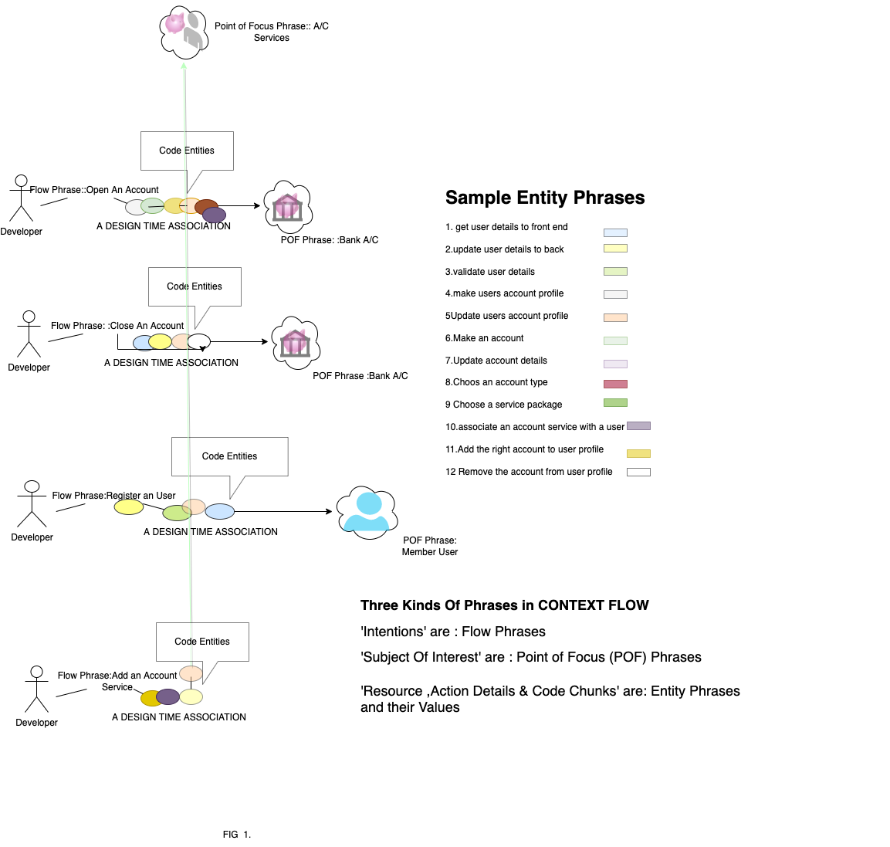
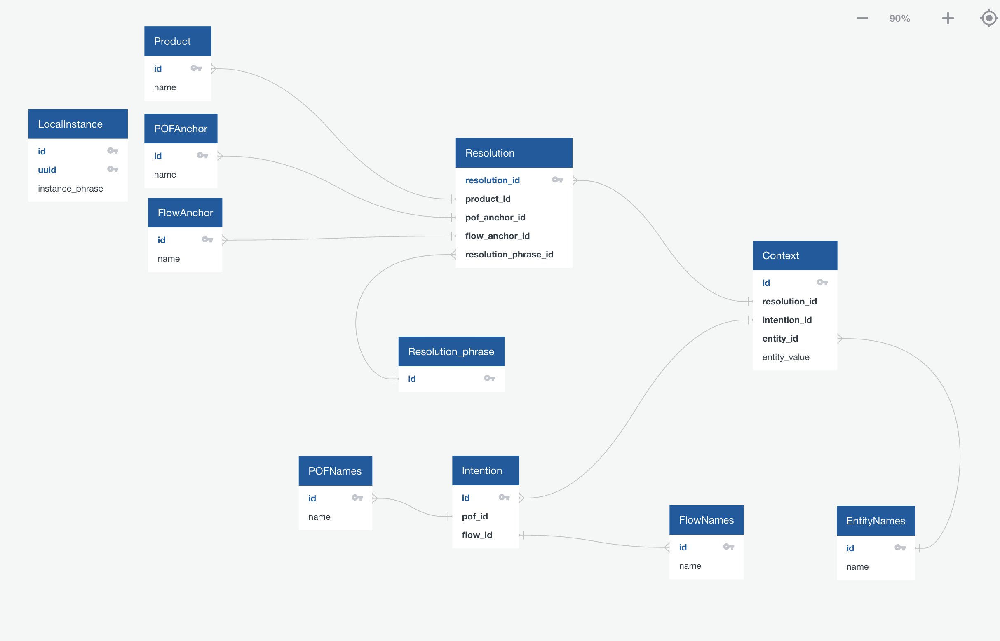

## What are the First Principles of Computing ? {Work In Progress}

One may think of 'following a logical thinking', 'ability to break bigger problems into smaller ones' , 'ability to see the commonality between different approaches ' etc as the first principles. However while each of those qualities are good imperatives, they hide a much more fundamental attitude of the mind that drives computing in ways not possible in other fields of engineering or science, without having a physical consequence. The reason being in the field of computing 'what' and 'how' are intertwined like no other scientific descipline [e.g one can always produce a massive size logarithmic table to print  'what is the log of a large number x ' without ever writing a program to show the 'how to generate the log of any number' ) and it is always this extra attitude of the mind that make a new 'what' come into the scope of computing.
In a one word this is "Intentions" , described in wikipedia as below:

"Intentions are mental states in which the agent commits themselves to a course of action. Having the plan to visit the zoo tomorrow is an example of an intention. The action plan is the content of the intention while the commitment is the attitude towards this content. Other mental states can have action plans as their content, as when one admires a plan, but differ from intentions since they do not involve a practical commitment to realizing this plan. Successful intentions bring about the intended course of action while unsuccessful intentions fail to do so. Intentions, like many other mental states, have intentionality: they represent possible states of affairs."

In the world of cumulative software development,where developers builds up on the work of others, if we follow a developer's first steps, in coding a piece of software ,it can be proposed ,with enough confidence, that the intention the coder had, definitely plays a part in the shape and content of code as it is developed over time. This foundational role of intention,however, covers,not only coding but also everything that the human kind design and contribute to the real world. Inspite of this obvious truth there remains no standard way to represent 'Intention' in software such that it can help the current and future developers who want to continue developing the code over time. But in todays world where society depends so much on computing ,this abiliy to continue developing and repurposing a software is absolutely critical. This makes it so  important that we can preserve an intention as part and parcel of chunks of software dedicated to that intention.

## CONTEXTFLOW

Contextflow is a methodology and a protocol to develop software ,in small pieces ,that can be joined up and composed through explicit intentions. 
Intentions serve as design time flow of design choices and connections. Contextflow recognises certain phrases used inside the software code or used even during the software lifecycle ,during the communication between developers and stakeholders, has a unique identification that can work as a hook into the intentions and design thoughts that are brought to life during development. As a software is weaved out from smaller pieces ,some of those critical phrases repeat in several situations and code conditions or contexts. Retention of these critical phrases in the right context during the development process also gives some surprising benifit in having some unique virtual adress of each resource used by the software like port numbers, files ,memory addresses and outputs. These virtual addresses of resources can also work favourably in allocating resources dynamically as the software is executed. 

## THE CONTEXT - A WIDER PERSPECTIVE
The concept of Context as embedded in the CONTEXTFLOW approach embraces a broader perspective on the three kinds of faculties in the human mind.These faculties are mapped into the CONTEXTFLOW elemnts as below: 
A context is effectively a point in a multi dimentional space . The three orthogonal faculties of the mind can be decribed as
           
       FOCUS [ability to bring an object in focus  (point of focus) on which intentions  play on,represnted POF
       INTETIONS [ability to capture the mind orientations that drives the actions that will act on the object in FOCUS],represented  as Flow
       MEASURE ENTITIES :[ ability to measure values with entity names , functions and their values]
                      
       We shall not  delve much  into the psychological or even philosophical discourse around these elements  in this project. Nonethe-less it is 
       worth mentioning this model of computation does present an alternative view of computation compared to standard view of computation as input -> p   process -> output ,also known an the Von Neumann architecture.

## CONTEXTFLOW & INTENTIONS

It is rather un-usual to bring the intentions into daily software life-dynamics. However once we start to look at intention as an outlook a developer has- when the developer is starting to write a piece of software, that has a purpose , we can assign, to an intention, the role of joining up small pieces that can achive a goal together , where the goal relates to a subject of interest, which is referred to as a 'point of focus (POF)'. This concept of a POF in Contextflow is almost opposite of the concept of  Object or concept of Class in software. In standard  object orientation, Class and Objects capture,  and encapsulate the behavoiour into one blob or the object- in contrast the point of focus is where conceptually all flow of intentions merge into, while each intention can carry a number of small code pieces which are reusable and each has a name and  they are referred to as entities. In ContextFLOW I implement this paradigm not through any special programming syntax but through some integrity rules around the flow,pof and entity names in a supporting data base which I call INTENTIONSPACE.  This allows the flow,pof and entities  to be any piece of string that has a unique representation in the data base. The  picture below illustrates how some flows can possibly drive a banking app development.:

As the coloured boxes show what could be the names for small chunk of codes ,which are called the Entities in CONTEXTFLOW. These code pieces appear ,as coloured ellipses,with different flows shown  as the developer's intention to achieve a goal. While the same entity name can appear in multiple flows e.g "update user account profile" with  cloured ellipse  does in the picture (indicated by green vertical line), the same name of the entity,the entity phrase will have unique address ,each carrying a value, which is the code segment;  the content of the code varies  with the actual point or the context of the usage. By appearing in different context each of the code segments will have a unique context-address and their value i.e the actual code segment, will be hold at these different addresses. 
The exact workings of this addressing mechanism and their uniquness will be explained further as we get into the data structure and database persistency in CONTEXTFLOW.

## ONE FLOW,ONE INTENTION--BACKEND-TO-FRONTEND 
The benifit of maintaining the integrity context of the names of pof ,flow and entities in CONTEXTFLOW is ,no matter what is the technology stack where a particular code piece runs , we have a single flow that covers all different technologies that are required to achieve a goal .Thus a simple flow like "open an Account" can span across front end and back end technologies with the right code segment entities that works in a particular setup. 

## CONTEXtFLOW PHRASE CATEGORIES
Contextflow is based on the proposition that there are three kinds of mental elements invoved in an intentionality of a software developer . These are i.point of focus, which is a phrase that determines the object around which intention is built, Flow, which is a phrase that articulates a specific intention  and Entity sequence ,one or more enties attached to a Flow  where each entity has a name and can hold a value of arbitrary kind.The content of these entities are the code and resources or a pointer to code and resources that make up the software. This way both the pof and flow acts as addresses to the actual code andresources. 

## THE INTENTION SPACE
The three kinds of mental elements can conveniently be represented in a relational persistency layer where each POF (point of Focus) can have an intention uniquely tied up with a particular entity sequence. Because any entity sequence can effectively softlink (i.e. hold a link as its value) to any other POF, the persistency layer provides a convenient means of retracing any  design thought process that lead to any specific code. Although I shall go through in detail how these relationship builds up ,following picture gives an idea about the nature of persistency layer that backs CONTEXTFLOW : the INTENTION SPACE:

## Same Phrase Multiple Ccontext: The concept of content driven addressing achieved through data base integrity rules.
A distinctive feature of CONTEXTFLOW is that each phrase in the three categories come with a unique id in its category; so e.g the occurrence of the same flow phrase with two different POF phrases will generate two unique addresses  as concatenation of the POF id and the FLOW id, occcurrence of the same entity name in two different concatenations of POF id and Flow id will create two unqiue addresses for the same entity name.  
The details of these itegrity rules will be explored further through real example.

## THE JSON Data Structure OF CONTEXTFLOW 

The relation between point of focus (POF) ,Flow and the entities can be captured in the following JSON structure :
           
   {
    "PS": [
      {
        "p": [
          "POF1",
          {
            "FS": [
              {
                "f": [
                  "flow1",
                  {
                    "ES": [
                      {
                        "entity1": "value"
                      }
                    ]
                  }
                ]
              }
            ]
          }
        ]
      }
    ]
}

In the above 'POF1','flow1' and 'entity1' are just illustrative names of certain POF ,Flow and Entity ; PS ,FS and ES are json structure of a set of POF ,Flows and Entities respectively. the elemnts 'p', 'f'  are the json structure of a single POF and Flow respectively.

## CONTEXTFLOW IMPLEMENTATION

I shall go through an implementation in detail through a series of expositions where we take a more traditional software (a react nodejs app) 
which does something useful for the user in a traditional way and I shall show in stages how bringing CONTEXTFLOW into the application development process provides firstly, a means of breaking an App into microservices while at the same time ,does indeed bring some unexpected advantages through context addressing and I shall also expose the way code pieces and resource details are stored in the CONTEXTFLOW  entities addressing system.

We start with exposition ZERO describing what the App does and what it solves in <a href="https://spicecoder.github.io/ContextFlow_Intro/exposure_zero">Exposure_Zero.</a>
